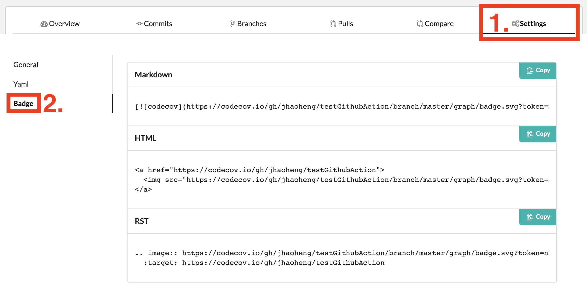

# 使用 

1. https://codecov.io, 註冊/登入
2. 新增 repo
3. 在 repo 的設定中, 可以找到 [Repository Upload Token]
4. 將 token 放到 github/repo 的 [Settings->Secrets], 新增名稱 CODECOV_TOKEN
5. 參考 .github/workflows/myWorkflows_coverage.yml 的做法 

# myWorkflows_coverage.yml 流程

1. 產生出 coverage file
2. 上傳到 CodeCov

# badge format
> [參考](https://github.com/TechnionYP5777/SmartCity-Market/wiki/Integrating-Codecov-with-a-GitHub-project-(Coverage-tool)#how-do-we-integrate-it-with-github)

1. 建立好 codecov 與 github 的 repo connection 後
2. 可至 codecov->repo->Settings->Badge 中取得

